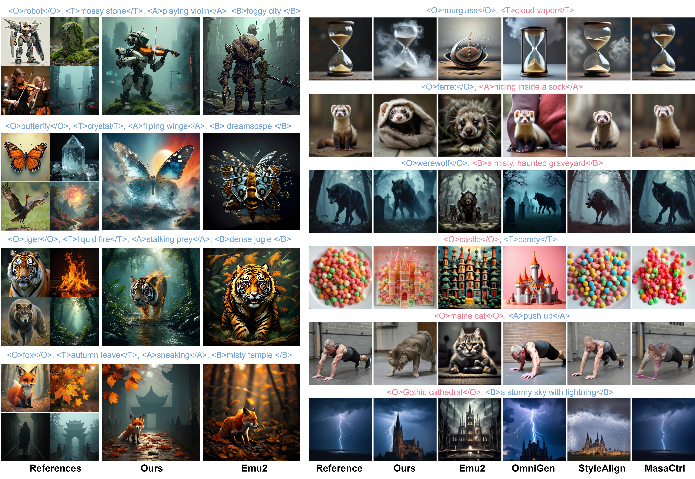

# TF-TI2I: Training-Free Text-and-Image-to-Image Generation via Multi-Modal Implicit-Context Learning in Text-to-Image Models

### Augment your T2I models with arbitrary number of images as references in a Training-Free manner 🔥🔥🔥


### Text-and-Image-to-Image Generation: Generating both prompt-following📃 and references-following🖼️ image.
### Key Features of TF-TI2Iy:
* ✅ **Training-Free Text-and-Image-to-Image (TF-TI2I)**: State-of-the-art method for text-and-image-to-image generation without training. 
* ✅ **Imaplicit Context Learning**: Disconver the Implicit Context Learning capability of textual tokens to extract visual details from vision tokens. 
* ✅ **Contextual Tokens Sharing (CTS)**: By sharing contextual tokens, we can effectively aggregate the visual informations from multiple images.
* ✅ **References Contextual Masking (RCM)**: To reduce the confliction between images, we propose References Contextual Masking to restrict the information learned from references.
* ✅ **Winnter-Takes-All (WTA)**: We propose Winner-Takes-All module to address the distribution shift and features confliction, by assigning each vision tokens with most sailent contextual tokens.
## 🦦0. Preparation
```
conda create -n tfti2i python=3.9 -y
conda activate tfti2i
pip install -r requirements.txt
```
## 🐾1. Run

With the environment installed, directly run the following script.
(Our method is based on the modification of SD3.5 model, which might require around 40GB VRAM (can be deployed on 2 x RTX4090))
### 1.1 Gradio Interface
* 👍User-friendly, direct image generation
* 👎Limit controlbilty
(Based on diffusers pipeline, we support multi-GPU distribution)
```
# gradio app support
CUDA_VISIBLE_DEVICES=0,1 python app_TF-TI2I.py
```

### 1.2 Jupyternote Book
* 👍Intuitive, flaxible
* 👎Not suit for large scale evaluation

```
# ipynb support
TF-TI2I.ipynb
```
### 1.3 Python Script
* 👍Suit for evaluation, parameter searching
* 👎Lacking flaxibilty

Before running the following script download the [FG-TI2I Benchmark](https://drive.google.com/drive/folders/1G4aZnNhiLvamSh2CjTF867auIK7MFD6a?usp=sharing)


put "1_single_entry" and "4_quad_entry" in "./data"
```
# Using TF-TI2I to generate for single_entry instances in FG-TI2I Benchmark
CUDA_VISIBLE_DEVICES=0,1 python TF-TI2I_single_entry.py

# Using TF-TI2I to generate for quad_entry instances in FG-TI2I Benchmark
CUDA_VISIBLE_DEVICES=0,1 python TF-TI2I_quad_entry.py
```
## 🌈2.Results


https://github.com/user-attachments/assets/50826f21-6be4-4e21-aabd-df45e0bb49a0





